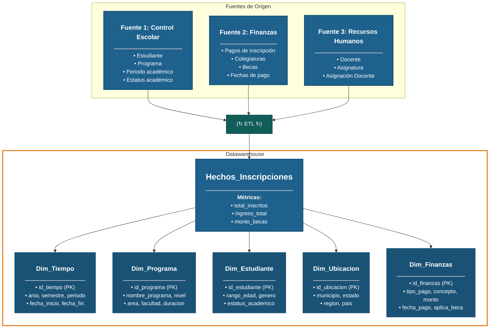

# Documentación del Data Warehouse - Inscripciones Académicas

## Descripción General

Este documento describe la arquitectura del Data Warehouse para el sistema de inscripciones académicas, implementando un esquema estrella (star schema) para optimizar consultas analíticas.

## Diagrama de Arquitectura



## Arquitectura del Sistema

### 1. Fuentes de Origen

El sistema integra datos de tres fuentes principales:

#### Fuente 1: Control Escolar
- **Estudiante**: Información demográfica y académica
- **Programa**: Detalles de los programas educativos
- **Periodo académico**: Calendarios y fechas importantes
- **Estatus académico**: Estado actual del estudiante

#### Fuente 2: Finanzas
- **Pagos de inscripción**: Registro de pagos iniciales
- **Colegiaturas**: Pagos periódicos
- **Becas**: Información de apoyos financieros
- **Fechas de pago**: Cronograma de pagos

#### Fuente 3: Recursos Humanos
- **Docente**: Información del personal docente
- **Asignatura**: Detalles de las materias
- **Asignación Docente**: Relación docente-asignatura

### 2. Proceso ETL (Extract, Transform, Load)

El proceso ETL:
1. **Extrae** datos de las tres fuentes de origen
2. **Transforma** los datos para limpiar, estandarizar y enriquecer
3. **Carga** los datos transformados en el Data Warehouse

### 3. Data Warehouse - Esquema Estrella

#### Tabla de Hechos: Hechos_Inscripciones

Tabla central que contiene las métricas cuantitativas:

| Campo | Descripción | Tipo |
|-------|-------------|------|
| total_inscritos | Número total de estudiantes inscritos | Numérico |
| ingreso_total | Suma de ingresos por inscripciones | Monetario |
| monto_becas | Total de becas otorgadas | Monetario |

#### Dimensiones

##### Dim_Tiempo
Permite análisis temporales de las inscripciones.

| Campo | Descripción |
|-------|-------------|
| id_tiempo (PK) | Identificador único |
| anio | Año académico |
| semestre | Semestre (1 o 2) |
| periodo | Periodo específico |
| fecha_inicio | Fecha de inicio del periodo |
| fecha_fin | Fecha de fin del periodo |

##### Dim_Programa
Información sobre los programas educativos.

| Campo | Descripción |
|-------|-------------|
| id_programa (PK) | Identificador único |
| nombre_programa | Nombre del programa |
| nivel | Nivel educativo (licenciatura, maestría, etc.) |
| area | Área de conocimiento |
| facultad | Facultad o escuela |
| duracion | Duración en semestres |

##### Dim_Estudiante
Datos demográficos y académicos de los estudiantes.

| Campo | Descripción |
|-------|-------------|
| id_estudiante (PK) | Identificador único |
| rango_edad | Rango de edad del estudiante |
| genero | Género |
| estatus_academico | Estado académico actual |

##### Dim_Ubicacion
Información geográfica de los estudiantes.

| Campo | Descripción |
|-------|-------------|
| id_ubicacion (PK) | Identificador único |
| municipio | Municipio de residencia |
| estado | Estado/provincia |
| region | Región geográfica |
| pais | País |

##### Dim_Finanzas
Detalles financieros de las inscripciones.

| Campo | Descripción |
|-------|-------------|
| id_finanzas (PK) | Identificador único |
| tipo_pago | Método de pago |
| concepto | Concepto del pago |
| monto | Monto del pago |
| fecha_pago | Fecha del pago |
| aplica_beca | Indicador de aplicación de beca |

## Ventajas del Esquema Estrella

1. **Simplicidad**: Fácil de entender y navegar
2. **Rendimiento**: Consultas más rápidas al minimizar joins
3. **Mantenimiento**: Más sencillo de mantener que esquemas copo de nieve
4. **Escalabilidad**: Facilidad para agregar nuevas dimensiones

## Consultas de Ejemplo

### Total de inscritos por programa
```sql
SELECT p.nombre_programa, SUM(h.total_inscritos) as total
FROM Hechos_Inscripciones h
JOIN Dim_Programa p ON h.id_programa = p.id_programa
GROUP BY p.nombre_programa;
```

### Ingresos por semestre
```sql
SELECT t.anio, t.semestre, SUM(h.ingreso_total) as ingresos
FROM Hechos_Inscripciones h
JOIN Dim_Tiempo t ON h.id_tiempo = t.id_tiempo
GROUP BY t.anio, t.semestre;
```

### Becas por región
```sql
SELECT u.region, SUM(h.monto_becas) as total_becas
FROM Hechos_Inscripciones h
JOIN Dim_Ubicacion u ON h.id_ubicacion = u.id_ubicacion
GROUP BY u.region;
```

## Consideraciones de Implementación

- **Actualización**: El proceso ETL debe ejecutarse periódicamente (diario/semanal)
- **Calidad de datos**: Implementar validaciones durante la transformación
- **Índices**: Crear índices en las claves foráneas para optimizar consultas
- **Particionamiento**: Considerar particionar la tabla de hechos por tiempo
